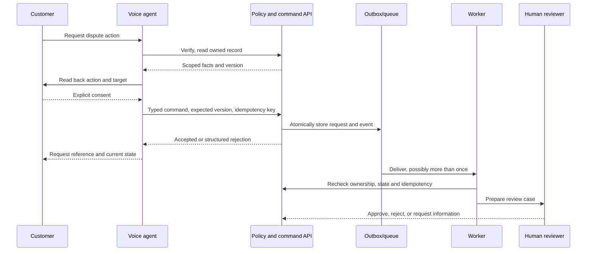

# Banking voice agent: implementation plan

Companion to [the product plan](project_plan.md). This is the coding sequence and repository contract, not permission to connect to a real bank. The repository currently has no application code. Reference projects are read-only examples; inspect their installed versions and refactor any borrowed code to this repository's `AGENTS.md` before use.

## Technical starting point

- Build a Python service with separate **voice**, **banking API/policy**, and **worker** entry points, plus a small browser client for the pilot. Keep deployment modular: voice and API may share a codebase, while command processing runs independently. A phone transport can be added after the bank chooses its channel.
- Use Pipecat for the voice pipeline because both reference projects already exercise it. Start with one orchestrator and typed tools; add LangGraph only if a measured workflow requires it. Do not put authorization, dispute state changes, or approval decisions inside a prompt or graph.
- Start with a transactional relational store for request/outbox, dispute workflow, policy configuration, and audit metadata. An outbox poller can act as the durable queue in the pilot; switch to the bank's broker if required without changing command contracts. Keep bank transaction and identity systems behind adapters. Use synthetic accounts and transactions until an approved integration exists.
- Candidate packages, **not yet added**: `pipecat-ai` for realtime voice; `FastAPI` for typed HTTP boundaries; `SQLAlchemy` and `Alembic` for transactional persistence/migrations; `pymupdf4llm` for approved PDF extraction; Pipecat browser packages plus Vite for the pilot client. Confirm versions, licenses, security review, and bank infrastructure before adding each dependency. Use `uv`/`.venv` for Python work.

## Reference map

| Need | Existing implementation to inspect | Reuse decision |
| --- | --- | --- |
| Voice pipeline and browser transport | [VoiceAgent voice_agent/bot.py](/Users/ashishprajapati/Documents/ChatGPT/VoiceAgent/voice_agent/bot.py:66), [frontend/src/main.js](/Users/ashishprajapati/Documents/ChatGPT/VoiceAgent/frontend/src/main.js:192) | Adapt Pipecat STT → context → LLM → TTS, SmallWebRTC, interruption, and client lifecycle. Split the large bot setup into small modules and add bank session state. |
| Provider setup and speech delivery | [VoiceAgent voice_agent/services.py](/Users/ashishprajapati/Documents/ChatGPT/VoiceAgent/voice_agent/services.py:25), [delivery.py](/Users/ashishprajapati/Documents/ChatGPT/VoiceAgent/voice_agent/delivery.py:86), [test_delivery.py](/Users/ashishprajapati/Documents/ChatGPT/VoiceAgent/tests/test_delivery.py:16) | Adapt settings-based provider construction and interruption-tested buffering. Choose provider, language, and retention through bank review. |
| Tool schema/result pattern | [VoiceAgent voice_agent/orders.py](/Users/ashishprajapati/Documents/ChatGPT/VoiceAgent/voice_agent/orders.py:186), [Test_Agent voice_agent/tools.py](/Users/ashishprajapati/Documents/Test_Agent/voice_agent/tools.py:14) | Adapt typed tool handlers and result callbacks. Replace order-number lookup with server-derived customer scope and narrow transaction/dispute methods. |
| Manuals and source evidence | [Test_Agent extract_pdf.py](/Users/ashishprajapati/Documents/Test_Agent/extract_pdf.py:11), [app.py](/Users/ashishprajapati/Documents/Test_Agent/app.py:28), [page_tools.py](/Users/ashishprajapati/Documents/Test_Agent/page_tools.py:12) | Adapt page extraction, content hashing, page references, and bounded retrieval. Add bank-only ingestion, approval/version metadata, effective dates, access classification, and retrieval evaluation. Exact text search is a baseline, not a complete retrieval strategy. |
| Background tasks and staff notes | [VoiceAgent voice_agent/notes.py](/Users/ashishprajapati/Documents/ChatGPT/VoiceAgent/voice_agent/notes.py:72), [Test_Agent voice_agent/graph.py](/Users/ashishprajapati/Documents/Test_Agent/voice_agent/graph.py:106) | Borrow nonblocking observer and evidence-capture ideas only. Their `asyncio.Queue` work is lost on crash and cannot carry dispute commands. Persist cases and commands in the outbox. |
| Latency and diagnostics | [VoiceAgent voice_agent/metrics.py](/Users/ashishprajapati/Documents/ChatGPT/VoiceAgent/voice_agent/metrics.py:29), [scripts/check_voice_pipeline.py](/Users/ashishprajapati/Documents/ChatGPT/VoiceAgent/scripts/check_voice_pipeline.py:16) | Adapt turn timing and test harness; remove raw transcript fields from operational metrics. Add tool, verification, queue, and handoff latency. |

Do **not** bring over [model-written SQL](/Users/ashishprajapati/Documents/ChatGPT/VoiceAgent/voice_agent/database_query.py:153), the [full data browser](/Users/ashishprajapati/Documents/ChatGPT/VoiceAgent/voice_agent/orders.py:54), [unapproved PDF upload](/Users/ashishprajapati/Documents/Test_Agent/app.py:28), or [raw tool argument activity events](/Users/ashishprajapati/Documents/Test_Agent/voice_agent/activity.py:45). Those are useful in demos but violate the planned banking access and data-minimization boundaries. The graph enrichment pipeline is optional; it is not needed to answer from approved manuals.

## Proposed repository layout

```text
banking_agent/
  config/                 settings and bank policy loaders
  models/                 one shared type or Pydantic model per file
  voice/                  Pipecat pipeline, provider setup, tool bridge
  knowledge/              approved ingestion, index, retrieval, citations
  identity/               verification client and scoped session
  banking/                transaction and dispute read adapters
  disputes/               command API, rules, request/outbox repository, worker
  cases/                  staff case builder and notification adapter
  audit/                  redacted security events and traces
frontend/                 pilot voice client and minimal case/status views
migrations/               schema migrations
tests/                    domain, API, worker, voice and security tests
docs/                     product plan, implementation plan, coding guide
```

Keep configuration values in settings. Define shared models outside implementations, use `snake_case` Python modules, and emit dotted structlog event names. Do not build generic repositories or provider abstractions before a second implementation needs them.

Initial file ownership for coding agents:

| Boundary | First modules to create | Responsibility |
| --- | --- | --- |
| Voice | `voice/bot.py`, `voice/services.py`, `voice/tools.py`, `voice/session_state.py` | Pipecat lifecycle, provider construction, typed tool bridge, confirmation state; no database client. |
| Knowledge | `knowledge/ingest.py`, `knowledge/retrieval.py`, `models/source_reference.py` | Approved document versions, bounded passages, citations, source validity. |
| Identity and reads | `identity/verification.py`, `models/verification_context.py`, `banking/transactions.py`, `banking/disputes.py` | Bank identity adapter, scoped authorization, narrow masked reads. |
| Writes | `models/dispute_command.py`, `disputes/command_service.py`, `disputes/repository.py`, `disputes/worker.py`, `disputes/rules.py` | Validation, outbox transaction, deduplication, state/version checks, replay-safe processing. |
| Human handoff | `cases/report.py`, `cases/notifications.py`, `audit/events.py` | Structured case, redacted notice, security and operational evidence. |

These are intended boundaries, not a mandate to create empty modules. Add a file when its milestone begins and simplify after the first working implementation.

## Service contracts and execution path

1. **Public guidance:** `search_approved_manual(query)` returns bounded passages with document ID, version, page/section, effective date, and classification. The answer builder may speak a claim only if source evidence supports it; otherwise it clarifies or transfers. Manual text is untrusted data.
2. **Verification:** `start_verification(session)` and `get_verification_result(session)` call the bank-owned identity provider. The bank service, not the LLM, binds customer ID, permitted actions, expiry, and authentication evidence to the voice session. No spoken OTP. All customer-data tools fail closed without that context.
3. **Authorized reads:** `list_customer_transactions`, `get_transaction`, `get_dispute`, and `get_request_status` accept server-derived customer identity; each adapter enforces account/dispute ownership and returns masked, allowlisted fields. The LLM never supplies customer ID or SQL. Status reads distinguish request processing state from dispute approval state.
4. **Dispute writes:** `submit_dispute_command` accepts a validated `create`, `amend`, or `withdraw` payload only after voice readback and explicit consent. The service validates identity, ownership, current version, allowed transition, duplicate rules, and rate limits. It commits the request plus outbox event atomically and returns `accepted` with a request ID. A worker applies it idempotently and routes the case for human approval.
5. **Outcomes:** use the [product plan's outcome codes](project_plan.md#command-processing-and-failure-handling) with a safe message and correlation ID. On an unknown result, query by idempotency key; do not let the LLM resubmit with a new key. Staff approval, not queue acceptance, changes final dispute status.
6. **Voice interruptions:** read tools may be cancelled when the customer interrupts. A write tool must not be treated as cancelled after durable acceptance; return or recover the request ID and state. Confirmed intent is held in deterministic session state, outside free-form chat history. [Current Pipecat function-call guidance](https://github.com/pipecat-ai/docs/blob/main/pipecat/learn/function-calling.mdx) describes interruption cancellation and result callbacks; verify exact APIs against the version locked for this project.



## Coding milestones for agents

| Order | Build and verify | Completion evidence |
| --- | --- | --- |
| 0 | Record bank decisions from the product plan; choose voice channel, runtime, identity sandbox, dispute states, queue infrastructure, retention, and notification destination. Add only approved dependencies with a lockfile. | Configuration and synthetic fixtures are sufficient to run locally without real customer data. |
| 1 | Build Pipecat pilot with provider settings, browser transport, interruptions, and redacted timing. Keep tools limited to public guidance. | A synthetic call starts, answers, interrupts, and ends; no customer-data route is reachable. |
| 2 | Build approved document ingestion, versioned index, page/section retrieval, grounded answer checks, and handoff on missing/conflicting evidence. | Tests cover stale documents, prompt injection, absent sources, and citation accuracy. |
| 3 | Build verification/session and narrow transaction/dispute read adapters with synthetic data. Wire typed voice tools through the policy service. | Cross-customer IDs, expired sessions, provider errors, and guessed identifiers reveal nothing. |
| 4 | Build dispute state rules, command API, request/outbox store, idempotent worker, status reads, and human review case. Then wire create/amend/withdraw voice flows. | Parallel duplicate calls have one effect; stale versions fail; crash/replay recovers; customer hears request state rather than approval. |
| 5 | Add secure staff notification and case format, audit events, operational alerts, privacy controls, and bank pilot tests. | Reviewer sees facts, checks, source versions, uncertainty, and next action; notification carries only redacted summary and link. |

At each milestone, run focused tests in `uv`/`.venv`, then the available lint and full test/build gates. Review the first working version for unnecessary abstractions and repeated work. Do not copy code across repositories without checking licensing, current package APIs, this repository's `AGENTS.md`, and security implications.

## Pending integration choices

The references prove a **browser WebRTC** path, not a production phone/IVR path. The target bank, jurisdiction, manuals, identity provider, transaction/dispute APIs, case system, broker/database, deployment environment, and approved model/speech providers remain unchosen. Treat their adapters as interfaces backed by synthetic fixtures until these choices are confirmed. Current Context7 Pipecat documentation was checked, but it is not a version-pinned snapshot of the reference projects' `pipecat-ai` 1.8.1 dependency.
