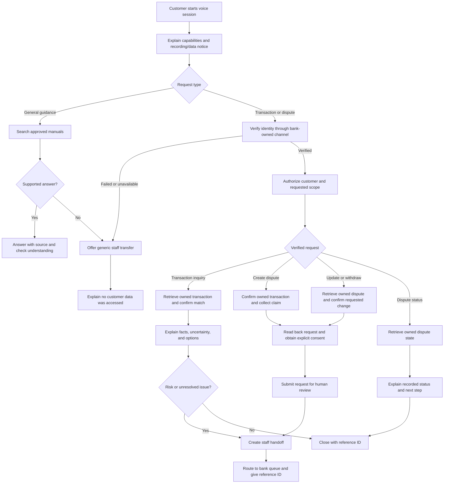
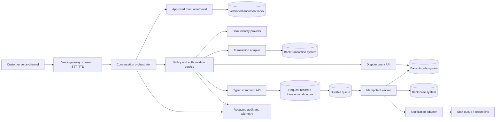

# Banking customer support voice agent: implementation plan

Status: planning baseline. No bank, jurisdiction, source manuals, core banking API, identity provider, or staff notification channel is configured in this repository yet. Provider and policy choices below are decision gates, not implementation facts.

## Goal and release boundary

Offer voice support for approved banking guidance, verified transaction concerns, and verified dispute management. The agent explains what it can substantiate, records customer requests, and gives staff a concise, traceable case when human action is needed.

| Capability | First release behavior | Boundary |
| --- | --- | --- |
| General guidance | Answer from approved, versioned bank manuals and guides; identify the source to the customer; ask or transfer when evidence is missing. | Never invent bank policy or use customer data to answer a public question. |
| Transaction inquiry | After identity verification, retrieve only transactions owned by the verified customer and explain available merchant, amount, time, status, and bank-provided descriptors. | Do not claim a transaction is legitimate or fraudulent with certainty. |
| Dispute creation | After verification, confirm the owned transaction, reason, and customer intent; submit a dispute request and return its reference and pending status. | A human reviews and approves or rejects the dispute. The bot never promises a refund or outcome. |
| Dispute update | After verification, retrieve an owned dispute, confirm the proposed change, and submit an amendment for review. | Preserve the original record and change history; do not silently overwrite a reviewed decision. |
| Dispute withdrawal | After verification, confirm which owned dispute the customer wants to remove and submit a withdrawal request. | No hard deletion; bank policy and a human determine whether withdrawal is permitted and final. |
| Dispute status | After verification, retrieve an owned dispute and explain its bank-recorded state and next step. | Do not infer approval from a pending state or expose staff-only notes. |
| Human escalation | Route suspected unauthorized activity, high-value transactions, uncertainty, or failed self-service to the configured bank team with a structured case. | Notification contains a case link and minimum necessary data; staff action remains with the bank. |

The first release does not move money, change account settings, block cards, reverse transactions, approve disputes, or make final fraud decisions. These require separate bank authorization, policy, and controls.

## Customer journey

For an unauthorized transaction claim, use neutral wording, preserve the customer's assertion verbatim, give the bank's approved immediate safety instructions, and escalate promptly. Do not persuade the customer that a disputed charge is harmless. If the transaction or dispute cannot be found, is pending, or data conflicts, explain the uncertainty and route it for review. An unverified caller receives only generic guidance or a live transfer; the agent does not access customer records or submit a dispute request.

## Architecture and trust boundaries

- **Voice gateway:** manages call/session identity, consent, speech recognition, speech playback, interruption, and transfer. A transcript is untrusted input; speech recognition errors must be confirmed before selecting a transaction or recording a claim.
- **Conversation orchestrator:** classifies intent, asks clarifying questions, drafts grounded responses and case summaries. It has no direct bank database credentials. Tool calls are limited to typed, allowlisted operations.
- **Manual retrieval:** ingests only bank-approved documents with owner, effective date, version, and access classification. Answers include a source reference; expired or conflicting documents force clarification or handoff. Retrieved text is data, never instructions for tool use.
- **Policy and authorization service:** enforces verification state, customer-to-account ownership, action scope, session expiry, rate limits, and escalation policy on every customer-data operation. The model cannot override these decisions.
- **Bank adapters:** expose narrow transaction and dispute reads. The dispute system owns the durable record and human approval state. The agent has no direct database or queue publishing access.
- **Command path:** the policy service passes a typed, validated request to the command API. It atomically stores an accepted request and outbox event before acknowledging it. A durable queue delivers work to a worker that rechecks ownership, policy, and current record version before writing to dispute or case systems. The notification adapter routes to configured recipients through a bank-approved channel. Queue delivery and worker execution may repeat; each effect must be idempotent.
- **Audit and telemetry:** records consent, authentication outcome, authorization decisions, document versions, transaction lookup and case actions, without OTPs, full account numbers, raw card data, or unnecessary transcript content.

## Security requirements

1. Public guidance may read the approved document index without customer verification. All customer, transaction, or dispute-system reads and writes, including status checks, creation, amendment, and withdrawal, require a verified session and server-side authorization. A spoken name, account number, caller ID, or voice match alone is insufficient.
2. Prefer confirmation in the bank's existing authenticated app or identity provider, bound to the live support session. The agent must never ask the customer to speak an OTP. If the bank chooses SMS/voice OTP as a fallback, its security team must accept that channel's risk and provide a stronger alternative.
3. Bind verification to customer ID, session, permitted action, and short expiry. Require renewed or stronger verification for a higher-risk action according to bank policy. Deny access on timeout, mismatch, or provider failure.
4. Resolve each transaction and dispute through server-side customer ownership checks; never trust an ID spoken by the caller as authorization. Mask identifiers in speech and case notifications. Encrypt stored and transmitted sensitive data, restrict staff access, and set bank-approved retention and deletion rules.
5. Treat user speech, transcripts, manuals, transaction descriptions, and retrieved text as untrusted. Validate tool parameters and outputs; keep policy enforcement outside prompts. Test prompt injection, cross-customer access, replay, and social engineering.
6. Make escalation rules deterministic and configurable: unauthorized-activity claim, bank-defined amount threshold, bank risk signal, data mismatch, or unresolved issue. Repeated verification failure produces a security event and generic transfer without a customer case. A threshold triggers review, not a fraud verdict.
7. Before any dispute write request, read back the target and requested action and obtain explicit customer consent. Reject stale versions and disallowed state transitions; append amendments and withdrawal requests to an audit trail. A withdrawal request never erases the dispute or its history.

## Command processing and failure handling

- **Command envelope:** action, server-derived customer ID, owned target ID, expected version, validated fields, verification and consent references, idempotency key, and correlation ID. Never use raw conversation text as an executable command.
- **Durable acceptance:** the command API returns a request ID only after the request and outbox event are committed together. `accepted` means queued for processing, not that a dispute was approved or a change applied. The agent checks request status through an authorized read API if processing is still pending.
- **Retry duplicates:** assign a server-generated idempotency key to each confirmed customer action and reuse it for retries. A repeated key returns the original request ID and state without another write. A timeout or unknown outcome prompts a status lookup, not a fresh command from the model. The orchestrator permits one mutating command per confirmed action until its outcome is known.
- **Business duplicates:** within the same verified customer scope, check for an existing open dispute on the same transaction and bank-defined dispute reason, or an equivalent pending amendment/withdrawal. Return the existing reference when appropriate. Similar wording alone is a review signal, not grounds to block a valid new claim. Never deduplicate across different customers or disclose whether another customer's dispute exists.
- **Abuse and concurrency:** rate-limit requests per customer, session, and target while monitoring aggregate spikes across customers. The worker uses a unique business constraint and expected record version or compare-and-swap to prevent concurrent requests from bypassing duplicate and state checks. Queue ordering alone is insufficient. Failed jobs go to a monitored retry/dead-letter path; retries use the same idempotency key.
- **Structured outcomes:** the API returns a machine-readable code, safe customer-facing message, request/reference ID when authorized, and `retryable` flag. The agent must not invent a success state or loop on an error. Only service-owned bounded retries may occur for transient failures.

| Outcome | Agent behavior |
| --- | --- |
| `accepted` / `already_submitted` | Give the existing reference and actual pending or completed state; do not submit again. |
| `existing_dispute` | Explain that this transaction already has an eligible dispute and offer its status or an amendment path. |
| `stale_version` / `invalid_state` | Refresh the authorized record once, explain the changed state, and ask for a new decision if a valid path remains. |
| `validation_failed` | Clarify the missing or invalid information before a new confirmation. |
| `unauthorized` / `verification_expired` | Stop customer-data access and reverify or transfer; reveal no record existence. |
| `rate_limited` / `temporarily_unavailable` | Stop write attempts. Say whether acceptance is known; if uncertain, check by idempotency key or request ID before offering staff transfer. |

## Dispute lifecycle

| Customer request | Bot action after verification | Human-controlled outcome |
| --- | --- | --- |
| Create | Submit a new dispute for an owned transaction as `pending_review`. | Approve, reject, or request more information. |
| Update | Append an amendment to an owned dispute as `change_pending_review`. | Accept or reject the amendment under bank policy. |
| Remove | Submit a withdrawal request as `withdrawal_pending_review`. | Confirm or reject withdrawal under bank policy; retain history. |
| Status | Read the bank-recorded state and next step. | Staff updates the authoritative state. |

The bank must define which states permit amendments or withdrawal, what happens if a decision has already been made, and whether a request needs stronger verification. The bot reports the authoritative result returned by the bank system, including a failed or rejected submission; it never describes a pending request as approved or withdrawn.

## Staff case contract

The secure case record contains: reference ID; dispute ID and requested action when applicable; verified customer ID and verification method/time/scope; masked account and transaction identifiers; customer concern in their words; transaction and dispute facts and status; relevant manual sections and versions; checks already performed and their outcomes; where the process failed or remains uncertain; risk triggers; action requested from staff; timestamps; and consent/audit references. Separate **customer statements**, **system facts**, and **agent inference**. The outbound Slack/email/queue notification should contain only priority, reference ID, short redacted summary, and a secure case link.

## Delivery sequence and acceptance gates

| Phase | Deliverable | Acceptance gate |
| --- | --- | --- |
| 0. Bank decisions | Confirm bank and jurisdiction, document owners, dispute workflow, identity method, transaction/dispute/case APIs, escalation owners, notification channel, data retention, amount thresholds, and response times. | Bank product, fraud, security, and operations owners approve policy and data flow. |
| 1. Grounded guidance | Versioned manual ingestion, retrieval, voice answer, source trace, missing-answer handoff. | Test questions use current approved sources; conflicting, expired, and absent guidance does not yield invented advice. |
| 2. Verified inquiry | Bank-owned verification, scoped session, transaction adapter, masked voice output, authorization audit. | Wrong-customer ID, expired verification, replay, provider outage, and cross-account access are denied. |
| 3. Dispute management | Owned-dispute lookup, typed command API, transactional outbox, queue worker, creation, amendment, withdrawal request, status read, consent capture, escalation, structured case, notification routing. | Unverified and cross-customer actions fail; retries and duplicate customer requests create one effect; concurrent updates respect record versions; queue failures are visible and recoverable; staff approval controls final outcomes. |
| 4. Pilot | Staff review console or existing case system integration, monitoring, accessibility and language checks, incident runbook. | Bank owners sign off on realistic call simulations, security review, handoff quality, and rollback path. |

## Open decisions for the bank

- Target bank and jurisdiction; which manuals are authoritative and how updates are approved.
- Bank dispute states and allowed transitions, duplicate criteria, request rate limits, required evidence, review roles, approval rules, and whether amendment or withdrawal is allowed after a decision.
- Bank identity provider and supported verification fallback; voice and language channels.
- Transaction, dispute, and case system interfaces; staff queue and notification destination.
- Risk thresholds, urgency levels, business hours, response targets, privacy retention, and any required recording consent.

## Reference security guidance

- [NIST SP 800-63B, authenticator guidance](https://pages.nist.gov/800-63-4/sp800-63b/authenticators/): out-of-band verification, phishing resistance, and restricted PSTN authentication.
- [FFIEC authentication and access guidance](https://www.ffiec.gov/news/press-releases/2021/pr-08-11): risk-based access principles for financial institutions. Applicability depends on jurisdiction.
- [OWASP ASVS 5.0](https://owasp.org/projects/asvs): authorization, sensitive-data protection, and security logging verification.
- [OWASP LLM01:2025](https://genai.owasp.org/llmrisk/llm01-prompt-injection/): prompt-injection risks in retrieved documents and tool-connected systems.
